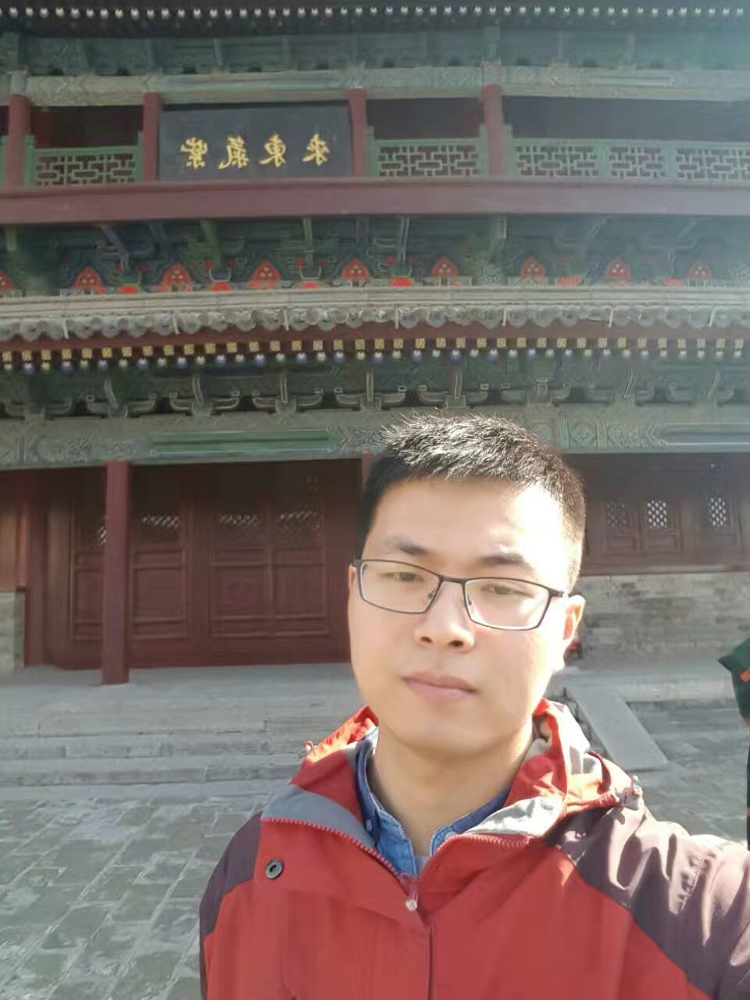

## Xing Wei (Ph.D. Candidate)

#### Personal Information

Office: Room 314, Geographical Building, East China Normal University, 3663 N. Zhongshan Rd, Shanghai, China.

Email: simba_wei@stu.ecnu.edu.cn

Short Bio: I got my bachelor's degree from Nanjing Tech University in 2016. I am currently working toward the PhD degree in East China Normal University. My research interests include in-memory computing, distributed query optimization and high-performance distributed system.

#### Readings
I share my readings on key words: DSM/KVS/New hardwares/NUMA/Query Optimization as a list. Welcome to discuss with me.

#### Projects
* **Parallel Scan**

* **Hash Reusing**

* **Shared Cache**

* **Distributed Page-based Memeory Management**
